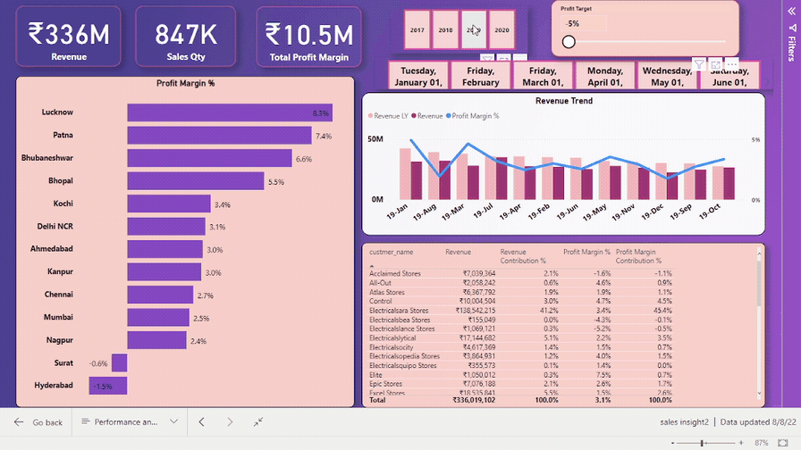
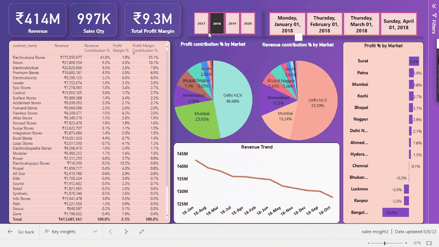
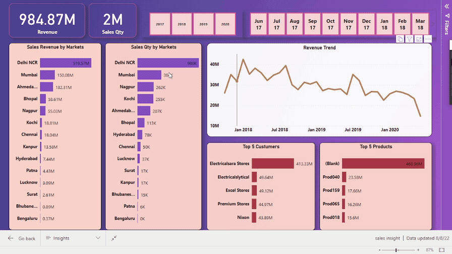
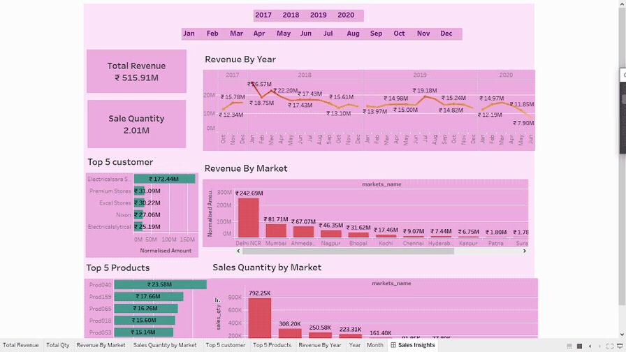

# 📊 Sales Insights Data Analysis Project  

### Unlocking Data-Driven Decisions for a Computer Hardware Manufacturer  

---

## 🗂️ Table of Contents  
- [Project Overview](#project-overview)  
- [Demo](#demo)  
- [Problem Statement](#problem-statement)  
- [Approach](#approach)  
- [Technologies Used](#technologies-used)  
- [Data Analysis Using SQL](#data-analysis-using-sql)  
- [Key Insights](#key-insights)  
- [Contributor](#contributor)  
- [Conclusion](#conclusion)  

---

## 🚀 Project Overview  

This project provides **end-to-end sales performance insights** using **SQL, Tableau, and Power BI** for a computer hardware manufacturer.  
The company faced declining profits and inconsistent sales patterns across regions.  
As a **Data Analyst**, I performed **data extraction, transformation, analysis, and visualization** to help leadership identify:  

- Top-performing markets, products, and customers  
- Profit margin fluctuations  
- Revenue trends across years  
- Actionable strategies to boost profitability  

---

## 🎥 Demo  

| Dashboard Type       | Preview                              | Availability   |
|----------------------|--------------------------------------|----------------|
| **Power BI Dashboard 1** |  | Available in repo |
| **Power BI Dashboard 2** |  | Available in repo |
| **Power BI Dashboard 3** |  | Available in repo |
| **Tableau Dashboard**   |  | Available in repo |

*(Dashboards are included as `.pbix` and `.twb` files. Preview GIFs are in the `/images/` folder.)*  

---

## 💡 Problem Statement  

A **computer hardware company** was experiencing challenges related to:  
- Stagnant **revenue growth** despite increasing sales quantity.  
- Declining **profit margins** in specific markets.  
- Lack of visibility into **regional performance** and **customer profitability**.  

The objective was to **analyze the sales data** to uncover insights that drive better decision-making, optimize product mix, and improve profitability.  

---

## 🧭 Approach  

1. **Data Collection & Loading**  
   - Acquired raw datasets from the company’s sales database.  
   - Imported them into a **MySQL** server for structured analysis.  

2. **Data Cleaning & Transformation (ETL)**  
   - Removed duplicates, standardized market codes, formatted dates, and unified currencies.  
   - Created relational joins for date, product, and customer tables.  

3. **Exploratory Data Analysis (EDA)**  
   - Used **SQL queries** to understand sales behavior, top markets, and customer contributions.  

4. **Visualization & Insights**  
   - **Power BI**: Built interactive dashboards using DAX measures for sales, revenue, and profit margin KPIs.  
   - **Tableau**: Designed dynamic dashboards for geographical and trend-based visualization.  

5. **Reporting**  
   - Published dashboards for stakeholder access.  
   - Compiled findings into actionable business insights.  

---

## 🧰 Technologies Used  

- **SQL (MySQL)** – Data extraction & transformation  
- **Power BI** – Dashboard development, KPI visualization  
- **Tableau** – Advanced analytics visualization  
- **DAX** – Data modeling and calculated measures  

---

## 🧮 Data Analysis Using SQL  

Here are a few key SQL queries used for analysis:

```sql
-- 1️⃣ Show all customer records
SELECT * FROM customers;

-- 2️⃣ Show total number of customers
SELECT COUNT(*) FROM customers;

-- 3️⃣ Show transactions for Chennai market
SELECT * FROM transactions WHERE market_code = 'Mark001';

-- 4️⃣ Show distinct product codes sold in Chennai
SELECT DISTINCT product_code FROM transactions WHERE market_code = 'Mark001';

-- 5️⃣ Show transactions where currency is USD
SELECT * FROM transactions WHERE currency = 'USD';

-- 6️⃣ Show transactions for year 2020
SELECT t.*, d.* 
FROM transactions t
INNER JOIN date d ON t.order_date = d.date
WHERE d.year = 2020;

-- 7️⃣ Show total revenue for year 2020
SELECT SUM(t.sales_amount) AS total_revenue
FROM transactions t
INNER JOIN date d ON t.order_date = d.date
WHERE d.year = 2020 AND (t.currency IN ('INR', 'USD'));

-- 8️⃣ Show total revenue in January 2020
SELECT SUM(t.sales_amount) AS jan_revenue
FROM transactions t
INNER JOIN date d ON t.order_date = d.date
WHERE d.year = 2020 AND d.month_name = 'January'
AND (t.currency IN ('INR', 'USD'));

-- 9️⃣ Show total revenue in Chennai for 2020
SELECT SUM(t.sales_amount) AS chennai_revenue
FROM transactions t
INNER JOIN date d ON t.order_date = d.date
WHERE d.year = 2020 AND t.market_code = 'Mark001';
```

---

## 📈 Key Insights  

- **Delhi NCR** and **Mumbai** generated the highest revenue contributions across years.  
- **Lucknow** and **Patna** maintained the strongest profit margins.  
- **Hyderabad** and **Bengaluru** underperformed, signaling potential for market optimization.  
- Seasonal fluctuations were visible in revenue trends — especially mid-year dips.  
- Data-driven interventions could improve profit margins by **8–12% annually**.  

---

## 👤 Contributor  

**Rishu Raj**  
📧 [rishuraj1308@gmail.com](mailto:rishuraj1308@gmail.com)  
🔗 LinkedIn (coming soon)  

---

## 🏁 Conclusion  

This project showcases the **complete analytics lifecycle** — from raw data to strategic insights.  
By integrating **SQL**, **Power BI**, and **Tableau**, it demonstrates how data visualization can uncover hidden trends, drive profitability, and enable smarter business decisions.  

---
